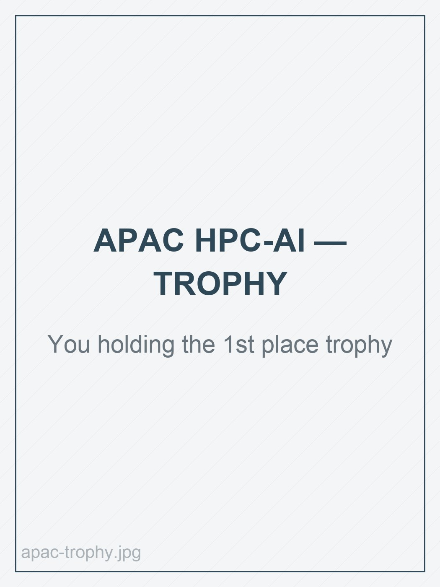
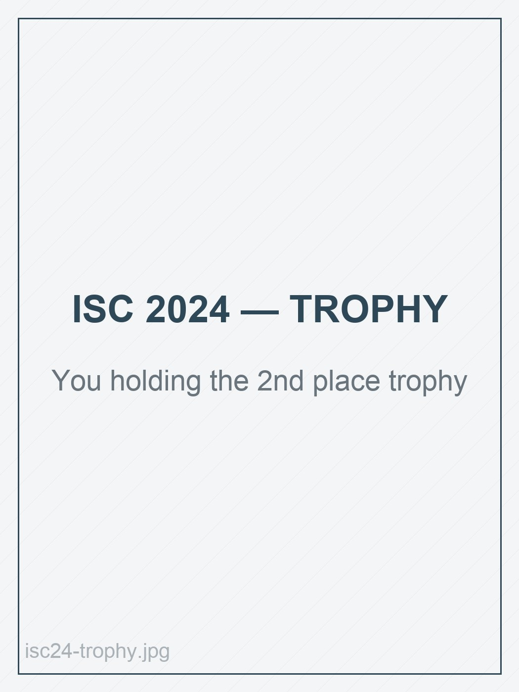
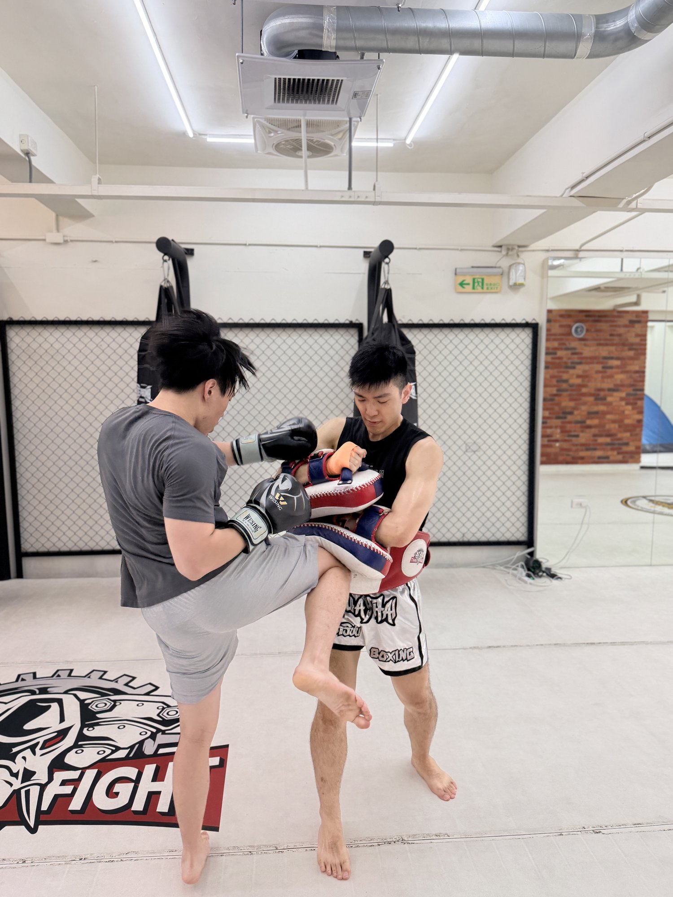
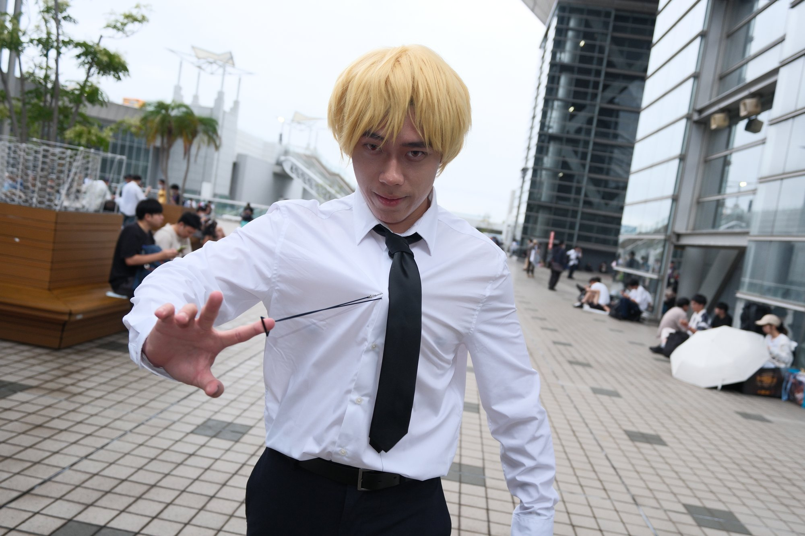
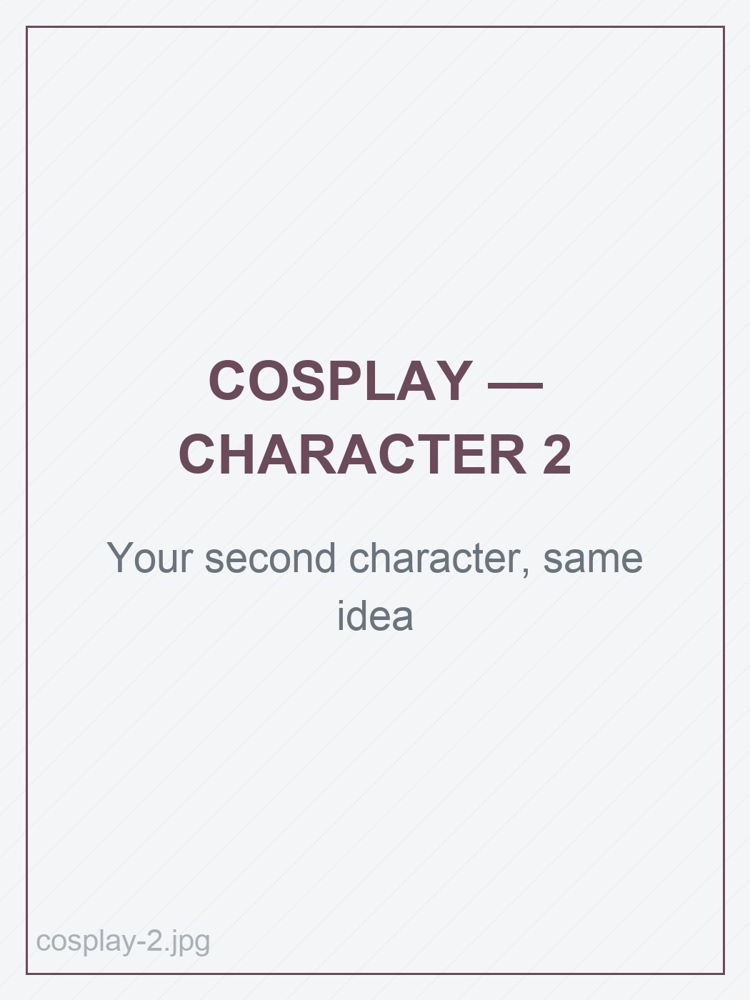

## Background

I grew up and studied in Taiwan, and finished a **Bachelor of Computer Science at
National Tsing Hua University** in July 2025 with a 3.97/4.30 GPA. After graduating
I completed Taiwan's mandatory military service, then prepared for the move to
Canada. I am now at UBC on a **CAD $10,000 Master of Data Science Scholarship**,
awarded on the recommendation of the MDS Admissions Committee, and graduate in June
2027.

My degree was a software engineering degree first: operating systems, parallel
programming, computer architecture, compilers. Most of what I actually know,
though, came from applying it.

**LSA Lab, 2022–2025.** I joined NTHU's LSA Lab and its supercomputing team in my
second year and stayed as a research assistant for three years, mostly on an
industry–academia collaboration with a company that needed AMD GPU performance
comparison, gap analysis, and porting research. My two main pieces of work were an
**ML-based workload scheduler**, which profiles incoming jobs and uses an XGBoost
classifier on system-level features to send each one to a CPU, NVIDIA, or AMD GPU
cluster, and bringing **LLMs up on AMD GPUs**, which meant porting frameworks such as
vLLM and DeepSpeed to ROCm, deploying LLaMA 70B on AMD Instinct MI210s, and
benchmarking the results against NVIDIA.

**Teaching.** From 2023 to 2025 I was a teaching assistant for four NTHU courses:
Operating Systems, Parallel Programming, and the fundamental and advanced High
Performance Computing Cluster Practice courses, each with more than 100 students. I
taught lab sessions, held office hours, and designed lab assignments, including a
CUDA Sobel edge-detection lab and a lab on porting CUDA code to AMD ROCm. Teaching a
thing is still the fastest way I know to find out whether I actually understand it.

**Internships.** A summer as a **Data Scientist intern at IBM** in Taipei (2024),
building models on internal business data and integrating them into internal
applications, and a summer as a **Software Engineer intern at Taiwan's National
Center for High-performance Computing** (2023), where I built a data re-uploading
classifier with quantum machine learning methods in PennyLane.

## Why data science

I did not come to MDS because I was missing engineering skill. I came because I
found the edge of what engineering skill alone can tell you.

IBM is where that became concrete. Spending a summer as a data scientist meant
watching models meet the actual conditions of deployment — messy inputs, shifting
distributions, stakeholders who need to know how much to trust a number and not how
many milliseconds it took to produce. I was good at the second question and had very
little to say about the first. My understanding of AI, I realised, was almost
entirely **system-side**: throughput, kernels, parallelism, memory, deployment. The
**model side** — how a model is designed, trained, validated, and judged — I had only
ever absorbed in passing, on the way to making someone else's model run faster.

The SC24 Reproducibility Challenge sharpened it further. My team reproduced the
findings of the *DataLife* paper on the 1000 Genomes Project, and reproducing a
result turns out to be a completely different skill from optimizing one. It is a
question about evidence, and I did not have the tools for it.

So MDS is a deliberate second half. Statistics, inference, experiment design, and
modelling taught properly — the part I could not have taught myself on a cluster.

## What I am building toward

A **full-stack ML/AI engineer**. Not a generalist who is vaguely aware of both ends,
but someone genuinely strong at each:

- **The model side** — framing the problem, designing and training the model,
  validating it honestly, and knowing what the result does and does not support.
- **The systems side** — acceleration, distributed training, inference optimization,
  deployment, and the data and serving pipelines around it.

These are usually the same problem and rarely the same person. A model that cannot
be served is a paper; a serving stack around a model nobody validated is a liability.
I have spent my undergraduate years on the second half, and MDS is where I bring the
first half up to match it.

## Competing on the world stage

International student cluster competitions were the centre of my undergraduate
years, and they are not a small thing. Teams apply from universities worldwide and
only a handful are selected to compete in person — fewer than twenty at SC and ISC —
after which you get a few days to configure, tune, and run real scientific and AI
workloads on hardware you are responsible for, against the strongest student HPC-AI
teams in the world, under a hard power budget.

| Competition | Result | Where |
| --- | --- | --- |
| **SC24 Student Cluster Competition** — the leading global HPC-AI student competition | **3rd place** 🥉 | Atlanta, US · Nov 2024 |
| **ISC High Performance SCC 2024** — one of the top three global supercomputing competitions | **2nd place** 🥈 | Hamburg, Germany · May 2024 |
| **APAC HPC-AI Competition 2023** — against 21 teams from 17 universities | **1st place** 🥇 | Sydney, Australia · Feb 2024 |
| **High Performance Application Competition 2023** — against 8 teams from 7 universities | **2nd place** 🥈 | Hsinchu, Taiwan · Aug 2023 |

Three podium finishes on the international stage in twelve months.

:::: {.photo-row}
::: {.photo-cell}
{fig-alt="Evan Pai holding the first place trophy from the APAC HPC-AI Competition"}
:::

::: {.photo-cell}
{fig-alt="Evan Pai holding the second place trophy from the ISC High Performance Student Cluster Competition"}
:::
::::

The technical write-ups — an 11.4× BLOOM inference speedup, an 18.5× CFD
acceleration, MLPerf Stable Diffusion tuning on H100s — are on the
[projects page](projects.qmd), along with photographs from each competition.

## Awards

- **Master of Data Science Scholarship**, University of British Columbia — CAD
  $10,000, awarded on the recommendation of the MDS Admissions Committee in
  consultation with the Faculty of Graduate and Postdoctoral Studies (2026)
- **3rd place**, SC24 Student Cluster Competition, Atlanta (2024)
- **2nd place**, ISC High Performance Student Cluster Competition, Hamburg (2024)
- **1st place**, APAC HPC-AI Competition, Sydney (2024)
- **2nd place**, High Performance Application Competition, Hsinchu (2023)

## Publication

C.-A. Pai *et al.*, "Critique of *Data Flow Lifecycles for Optimizing Workflow
Coordination*," by the SCC Team from National Tsing Hua University. *IEEE
Transactions on Parallel and Distributed Systems* (TPDS), in press.
DOI: [10.1109/TPDS.2025.3627428](https://doi.org/10.1109/TPDS.2025.3627428)

## What I work with

**Languages**: Python, C/C++, Bash, R, SQL

**AI systems and HPC**: CUDA, ROCm, NCCL, MPI, OpenMP, TensorRT, vLLM, DeepSpeed,
quantization, tensor parallelism, LLM inference optimization, profiling with Nsight
and nvprof, NVIDIA H100 and AMD MI210 clusters

**Machine learning**: PyTorch, TensorFlow, Hugging Face, XGBoost, LightGBM,
scikit-learn, RAG, feature engineering, cross-validation

**Data science**: pandas, NumPy, statistical inference, regression, experiment
design, data visualization, Jupyter, Quarto

**Software engineering**: Linux, Git and GitHub, Docker, object-oriented design,
CI/CD, AWS

R and the statistical half of this list are the newest parts, and they are what MDS
is adding. I update this section as the program goes rather than listing things I
have only read about.

## Where I am headed

I am looking for **full-time new-grad roles starting in mid-2027**, after MDS ends
in June. Vancouver comes first, then the rest of Canada. The roles I want most are
in **AI infrastructure and ML systems** (inference and training performance, GPU
software, ML platforms), followed by **machine learning engineering**, **software
engineering**, and **data science**. In all of them I want to be the person trusted
to frame the question, build the model, and own it in production. My engineering
side has already been tested at an international level, and MDS is what makes the
modelling and inference side just as credible.

## Outside of work

**Muay Thai.** I train a few times a week. It keeps me healthy, and the training is
where I get to push past whatever limit I thought I had that month, which is a
satisfying kind of growth to keep chasing. It has also given me a much better sense
of control over my body and my head, and it helps me build resilience.

::: {.photo-single}
{fig-alt="Evan Pai training Muay Thai, hitting pads"}
:::

**Cosplay.** I go to conventions in costume. Spending a day as a deliberately
non-everyday version of yourself is energising in a way that is hard to explain, and
watching the list of characters slowly grow is its own quiet satisfaction. I bring a
camera and come home with far too many photos, every time.

:::: {.photo-row}
::: {.photo-cell}
{fig-alt="Evan Pai in costume at a convention"}
:::

::: {.photo-cell}
{fig-alt="Evan Pai in a second cosplay costume at a convention"}
:::
::::

## Get in touch

The fastest way to reach me is [evan105pai@gmail.com](mailto:evan105pai@gmail.com). I am also on
[LinkedIn](https://www.linkedin.com/in/evanpai/) and
[GitHub](https://github.com/EvanPai).
