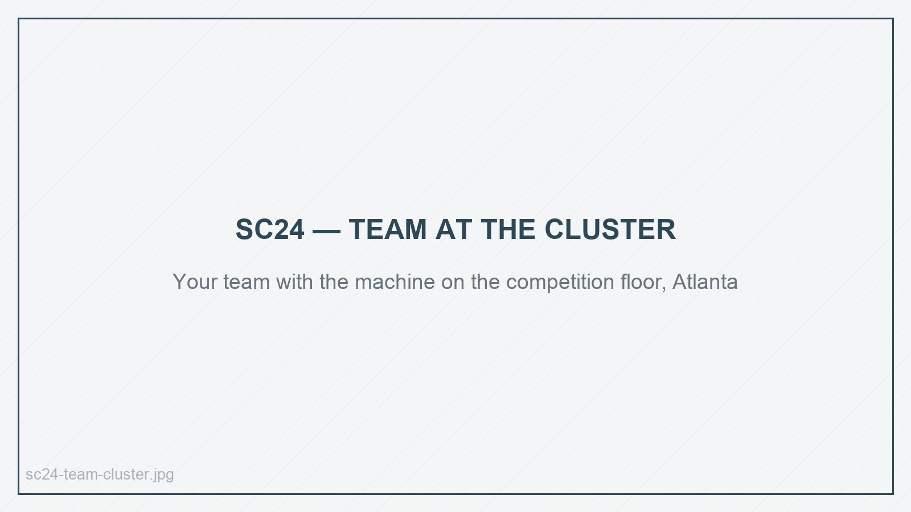
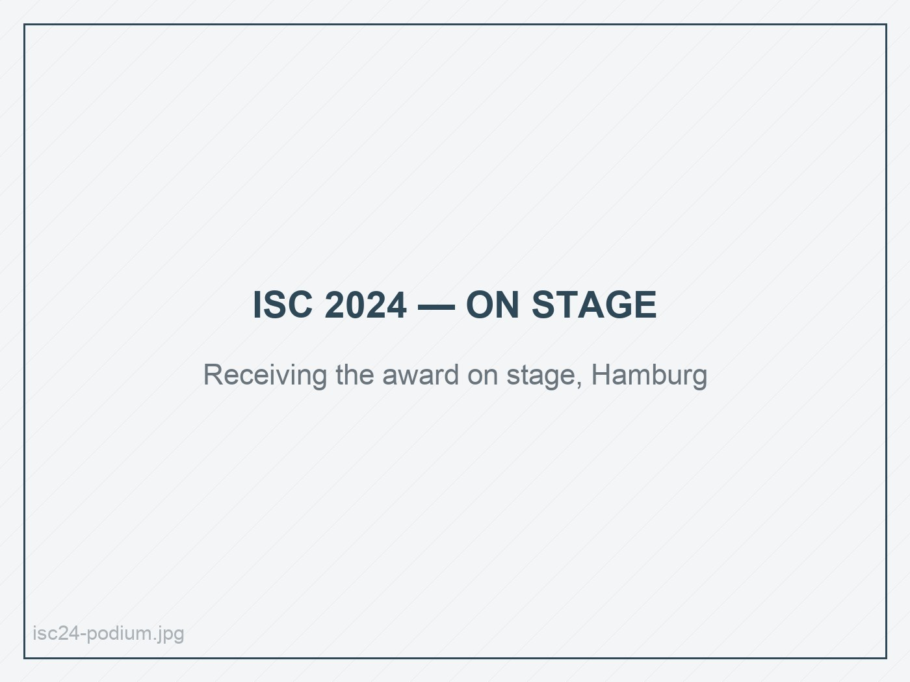
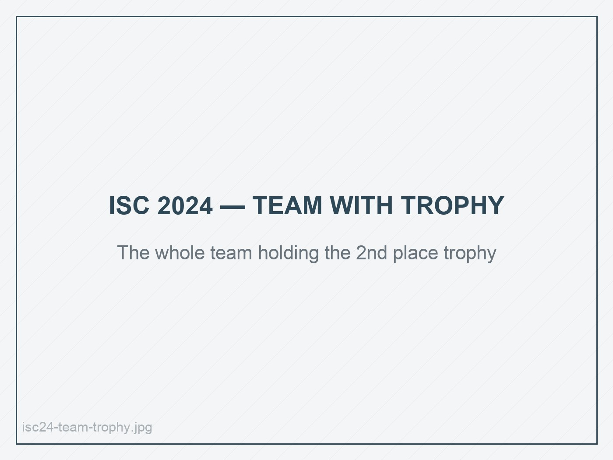
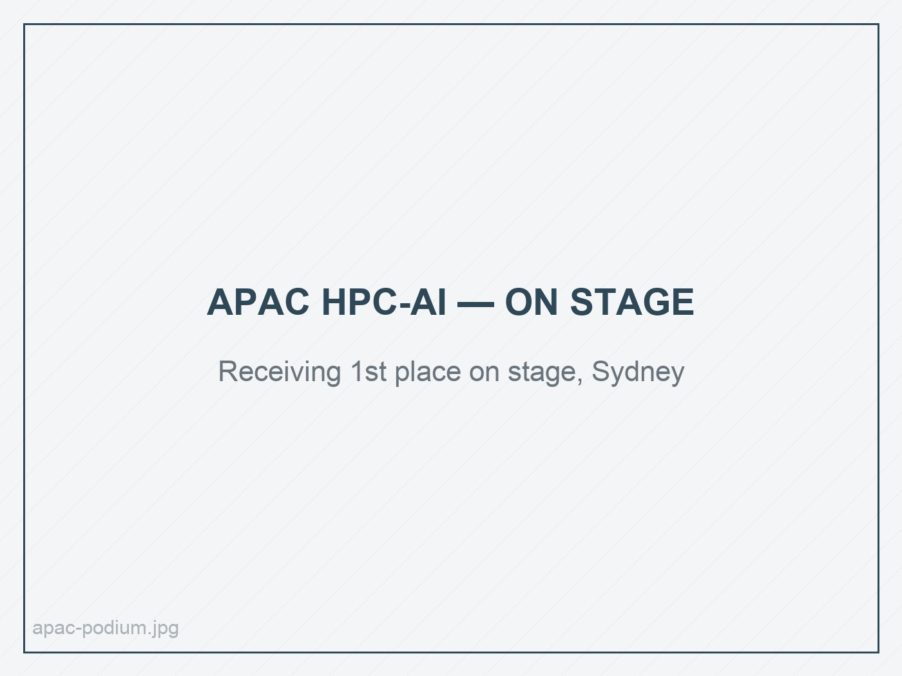
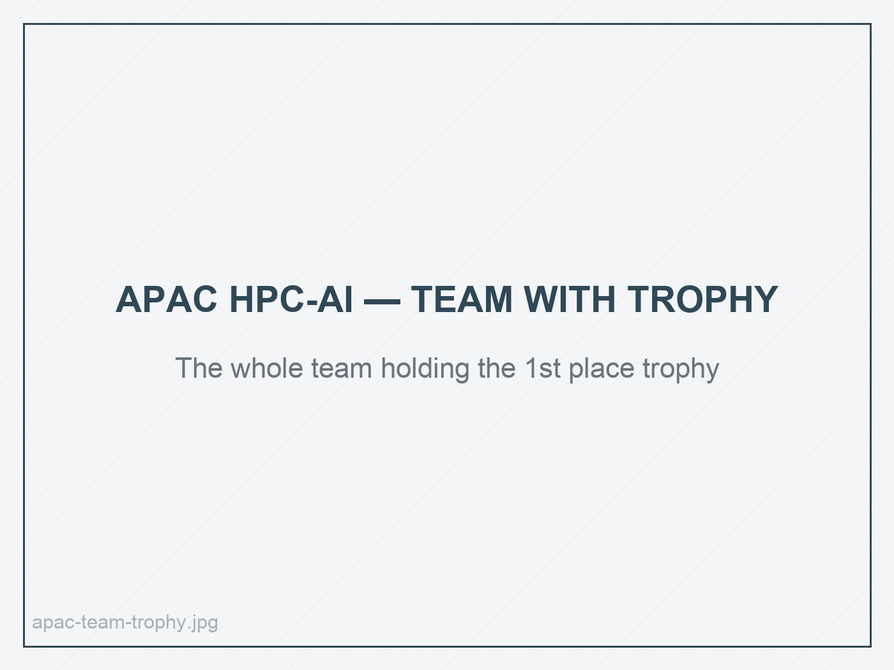
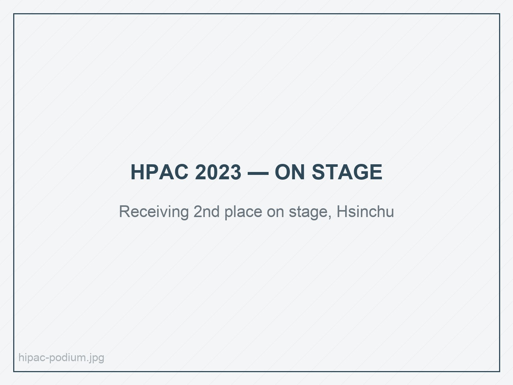

A few things explained properly, rather than a long list. Most of this work ran on
multi-GPU clusters — for world-championship student cluster competitions, for
industry partners, or as research and internship work.

## Local LLM deployment and inference optimization

**The problem.** Serving a 70-billion-parameter model as an interactive chatbot is a
systems problem, not a modelling one. Naive serving leaves most of the GPU idle
between requests, and the model does not fit comfortably on one card regardless.

**What I did.** Engineered an end-to-end local chatbot around **LLaMA 3.1 70B**,
served with **vLLM** behind a **Gradio** front end on 4 NVIDIA H100 GPUs, then went
through the inference path properly — continuous batching, kernel-level tuning, and
memory layout — measuring each change rather than stacking them and hoping.

**Outcome.** **3× throughput increase** over the baseline deployment, running
entirely locally rather than against a hosted API.

`LLaMA 3.1 70B` · `vLLM` · `Gradio` · `CUDA` · `4× H100` · `inference optimization`

---

## Industry collaboration: ROCm and AMD GPU evaluation

*Research lab industry–academia partnership · National Tsing Hua University · 2023–2025*

**The problem.** A partner company needed its workloads brought up and evaluated on
**AMD GPUs under ROCm**, in an ecosystem far less forgiving than CUDA and with much
thinner documentation.

**What I did.** Owned the engagement end to end as the engineer on it: brought up
the ROCm software stack, ported and validated the workloads, designed and ran the
experiments, and reported results in a form the company could actually act on. Close
to a year of production-grade software engineering, deadlines and stakeholders
included, rather than coursework.

**Outcome.** A working ROCm evaluation pipeline and a set of results the partner used
directly — plus a hard-won view of what portability across GPU vendors really costs.

`ROCm` · `AMD GPU` · `porting` · `benchmarking` · `industry delivery`

---

## SC24 Student Cluster Competition — 3rd place 🥉

*Atlanta, US · November 2024 · the leading global HPC-AI student competition, fewer
than twenty teams selected worldwide*

Three tasks over four days, on a cluster we configured, tuned, and were fully
responsible for, under a hard power budget:

- **MLPerf benchmarking.** Optimized **Stable Diffusion** for MLPerf on 4 NVIDIA
  H100 GPUs using **TensorRT**, tuning precision and kernel selection against the
  benchmark's accuracy constraints.
- **Mystery application — cat object detection.** Handed an unseen problem on the
  day, trained **YOLO11x** for object detection and placed **3rd** in that task.
- **Reproducibility challenge.** Reproduced the findings of the *DataLife* paper on
  the 1000 Genomes Project — the task that did the most to convince me I wanted the
  statistical half of this education.

The reproducibility work became a peer-reviewed critique, now in press at IEEE TPDS
([DOI: 10.1109/TPDS.2025.3627428](https://doi.org/10.1109/TPDS.2025.3627428)).

{fig-alt="The NTHU student cluster competition team standing with their cluster on the SC24 floor in Atlanta"}

`TensorRT` · `Stable Diffusion` · `YOLO11x` · `MLPerf` · `reproducibility`

---

## ISC High Performance SCC 2024 — 2nd place 🥈

*Hamburg, Germany · May 2024 · one of the top three supercomputing competitions in
the world*

**The problem.** Take **Neko**, a spectral-element CFD application, and make it run
as fast as possible on a 10 × NVIDIA H100 cluster inside a fixed power envelope,
against the strongest student HPC teams in the world.

**What I did.** Profiled the solver to find where time was actually going, then
worked the parallel decomposition, communication patterns, and system-level tuning —
the unglamorous part, done systematically, rather than guessing at compiler flags.

**Outcome.** **18.5× speedup** over the starting configuration, and 2nd place
overall on the international stage.

::: {layout-ncol=2}
{fig-alt="Evan Pai receiving the second place award on stage at ISC High Performance 2024"}

{fig-alt="The NTHU team holding the ISC 2024 second place trophy"}
:::

`CFD` · `parallel programming` · `MPI/NCCL` · `profiling` · `10× H100`

---

## APAC HPC-AI Competition 2023 — 1st place 🥇

*Sydney, Australia · February 2024 · first out of 21 teams from 17 universities*

**The problem.** Optimize inference for the **BLOOM** large language model across a
multi-GPU cluster — a full-stack LLM systems problem, from model partitioning down
to the interconnect.

**What I did.** Combined **tensor parallelism**, **DeepSpeed** inference
optimization, and **NVIDIA NCCL** collective tuning, isolating and measuring each
change so the final number could be explained rather than just reported.

**Outcome.** **11.4× inference speedup**, and first place overall.

::: {layout-ncol=2}
{fig-alt="Evan Pai receiving the first place award on stage at the APAC HPC-AI Competition"}

{fig-alt="The NTHU team holding the APAC HPC-AI Competition first place trophy"}
:::

`BLOOM` · `tensor parallelism` · `DeepSpeed` · `NCCL` · `LLM inference`

---

## FourCastNet end-to-end deployment — 2nd place 🥈

*High Performance Application Competition 2023 · Hsinchu, Taiwan · 2nd of 8 teams
from 7 universities*

Deployed and ran **FourCastNet**, an AI-driven global climate model, end to end:
environment setup, multi-node training, inference, and visualization. Less a
single-technique problem than a test of whether you can carry an entire AI workflow
from a bare cluster to a finished, interpretable result.

{fig-alt="Evan Pai receiving the second place award on stage at the High Performance Application Competition 2023"}

`FourCastNet` · `multi-node training` · `full-stack AI workflow`

---

## Quantum machine learning classifier

*National Center for High-performance Computing · Hsinchu, Taiwan · Summer 2023*

Implemented a **data re-uploading classifier** using quantum machine learning methods
in **PennyLane**, during a software engineering internship at Taiwan's national HPC
centre.

`PennyLane` · `QML` · `research`

---

## This website

Built as a [Quarto](https://quarto.org) project and published with GitHub Pages from
the `docs/` folder, set up so that a new post is a new folder and one `quarto render`
away. It is where my MDS coursework and projects will land over the coming year.

[Source on GitHub](https://github.com/EvanPai/EvanPai.github.io)

`Quarto` · `GitHub Pages` · `Git`
