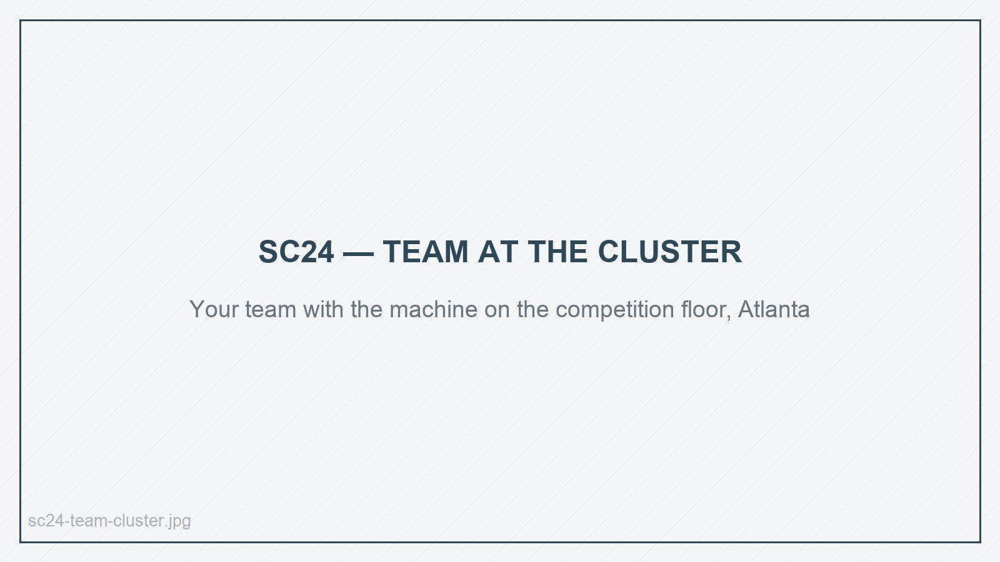
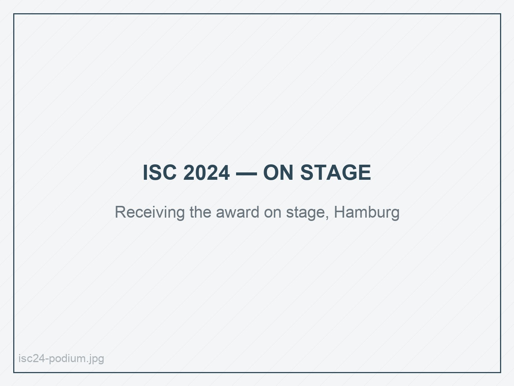
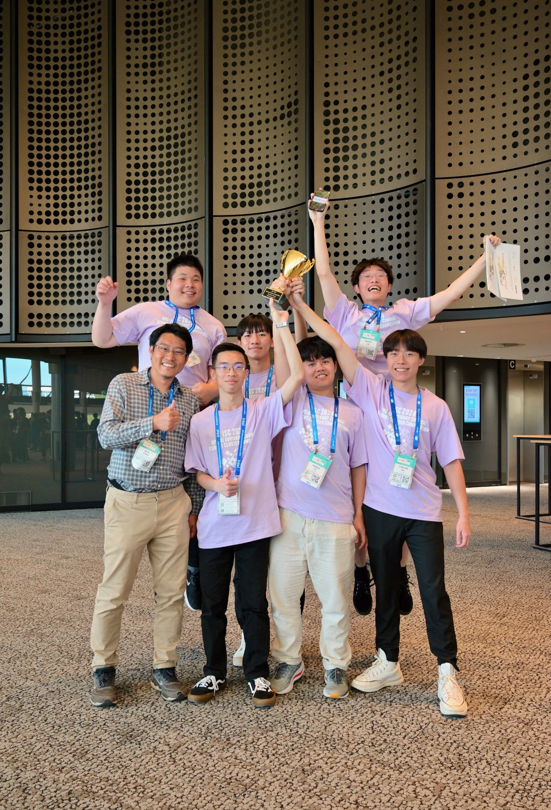
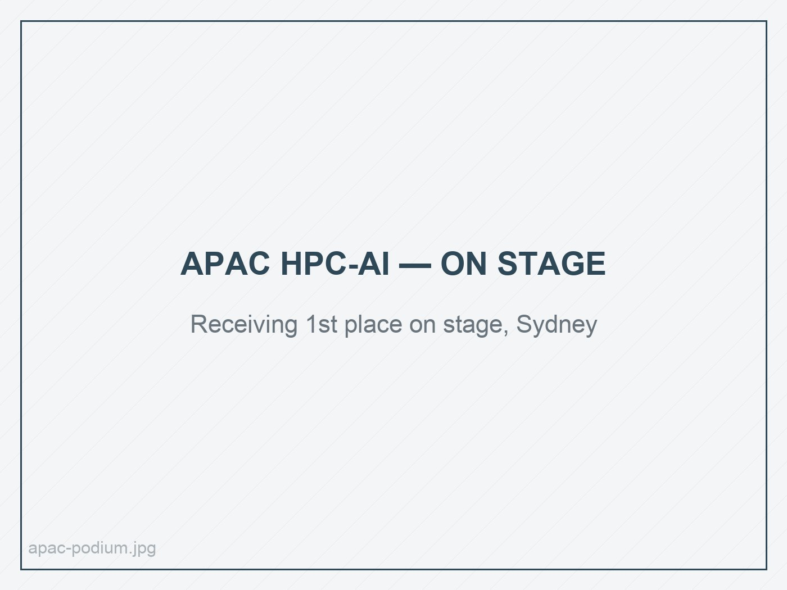
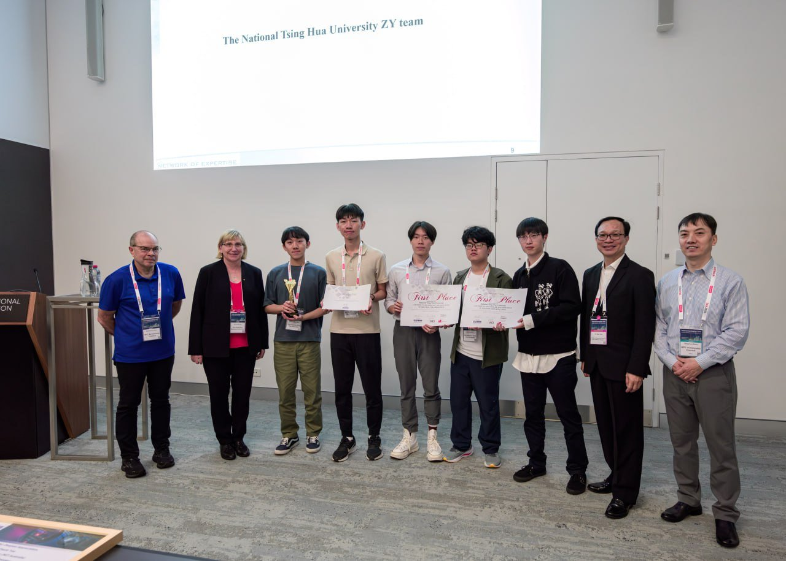
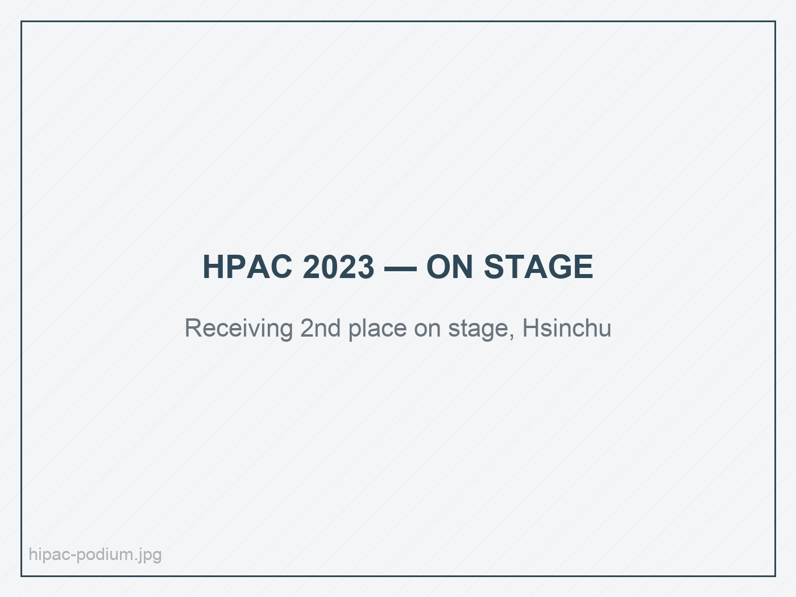

A few things explained properly, rather than a long list. Most of this work ran on
multi-GPU clusters — for world-championship student cluster competitions, for
industry partners, or as research and internship work.

## ML-based workload scheduler

*NTHU LSA Lab · industry–academia collaboration · 2022–2025*

**The problem.** The lab ran a mix of CPU, NVIDIA GPU, and AMD GPU clusters, and jobs
arrived without any hint of which hardware would suit them. Sending them blindly
leaves expensive accelerators idle while other queues back up.

**What I did.** Built a scheduler that detects incoming workloads, profiles them
ahead of time for duration and resource behaviour, and classifies them with
**XGBoost** on system-level features. Each job is then dispatched to the CPU,
NVIDIA, or AMD cluster that fits it, so the whole infrastructure stays busy. I also
built XGBoost and LightGBM datasets and models that served as workloads for it.

`XGBoost` · `LightGBM` · `feature engineering` · `job scheduling` · `heterogeneous clusters`

---

## LLMs on AMD GPUs: ROCm porting and evaluation

*NTHU LSA Lab · industry–academia collaboration · 2022–2025*

**The problem.** A partner company needed AMD GPU performance comparison, gap
analysis, and porting research. Most LLM tooling assumes CUDA, and the ROCm
ecosystem is far less forgiving and far less documented.

**What I did.** Ported LLM frameworks such as **vLLM** and **DeepSpeed** to **ROCm**.
That meant real code changes, adapting CUDA-oriented API calls to their ROCm
equivalents, plus a lot of build work: trying configurations and resolving version
and dependency conflicts until everything compiled and ran. I then deployed
**LLaMA 70B on AMD Instinct MI210 GPUs** and benchmarked vLLM, DeepSpeed, and
quantization against NVIDIA baselines.

**Outcome.** Working LLM deployments on AMD hardware and a comparison the partner
could use, plus a hard-won view of what portability across GPU vendors really costs.

`ROCm` · `AMD MI210` · `vLLM` · `DeepSpeed` · `quantization` · `porting` · `benchmarking`

---

## On-premise RAG system

*NTHU LSA Lab · for the NTHU campus computer center and course labs*

**The problem.** The campus computer center wanted an assistant that could answer
questions about its own internal documents. Sending that data to a hosted API was not
an option, and serving a 70-billion-parameter model locally is a systems problem:
naive serving leaves most of the GPU idle between requests.

**What I did.** Built a retrieval-augmented generation system around **LLaMA 3.1
70B**, served with **vLLM** behind a **Gradio** front end on 4 NVIDIA H100 GPUs, so
everything runs on-premise and confidential data never leaves campus. I then worked
through the inference path, tuning batching and kernels and measuring each change
rather than stacking them and hoping.

**Outcome.** **3× throughput** over the baseline deployment, running entirely locally.

`RAG` · `LLaMA 3.1 70B` · `vLLM` · `Gradio` · `4× H100` · `inference optimization`

---

## SC24 Student Cluster Competition — 3rd place 🥉

*Atlanta, US · November 2024 · the leading global HPC-AI student competition, fewer
than twenty teams selected worldwide*

Three tasks over four days, on a cluster we configured, tuned, and were fully
responsible for, under a hard power budget:

- **MLPerf benchmarking.** Optimized **Stable Diffusion** for MLPerf on 4 NVIDIA
  H100 GPUs using **TensorRT**, tuning precision and kernel selection against the
  benchmark's accuracy constraints.
- **Mystery application — cat object detection.** Handed an unseen problem on the
  day, trained **YOLO11x** for object detection and placed **3rd** in that task.
- **Reproducibility challenge.** Reproduced the findings of the *DataLife* paper on
  the 1000 Genomes Project — the task that did the most to convince me I wanted the
  statistical half of this education.

The reproducibility work became a peer-reviewed critique, now in press at IEEE TPDS
([DOI: 10.1109/TPDS.2025.3627428](https://doi.org/10.1109/TPDS.2025.3627428)).

::: {.photo-single}
{fig-alt="The NTHU student cluster competition team standing with their cluster on the SC24 floor in Atlanta"}
:::

`TensorRT` · `Stable Diffusion` · `YOLO11x` · `MLPerf` · `reproducibility`

---

## ISC High Performance SCC 2024 — 2nd place 🥈

*Hamburg, Germany · May 2024 · one of the top three supercomputing competitions in
the world*

**The problem.** Take **Neko**, a spectral-element CFD application, and make it run
as fast as possible on a 10 × NVIDIA H100 cluster inside a fixed power envelope,
against the strongest student HPC teams in the world.

**What I did.** Profiled the solver to find where time was actually going, then
worked the parallel decomposition, communication patterns, and system-level tuning —
the unglamorous part, done systematically, rather than guessing at compiler flags.

**Outcome.** **18.5× speedup** over the starting configuration, and 2nd place
overall on the international stage.

:::: {.photo-row}
::: {.photo-cell}
{fig-alt="Evan Pai receiving the second place award on stage at ISC High Performance 2024"}
:::

::: {.photo-cell}
{fig-alt="The NTHU team holding the ISC 2024 second place trophy"}
:::
::::

`CFD` · `parallel programming` · `MPI/NCCL` · `profiling` · `10× H100`

---

## APAC HPC-AI Competition 2023 — 1st place 🥇

*Sydney, Australia · February 2024 · first out of 21 teams from 17 universities*

**The problem.** Optimize inference for the **BLOOM** large language model across a
multi-GPU cluster — a full-stack LLM systems problem, from model partitioning down
to the interconnect.

**What I did.** Combined **tensor parallelism**, **DeepSpeed** inference
optimization, and **NVIDIA NCCL** collective tuning, isolating and measuring each
change so the final number could be explained rather than just reported.

**Outcome.** **11.4× inference speedup**, and first place overall.

:::: {.photo-row}
::: {.photo-cell}
{fig-alt="Evan Pai receiving the first place award on stage at the APAC HPC-AI Competition"}
:::

::: {.photo-cell}
{fig-alt="The NTHU team holding the APAC HPC-AI Competition first place trophy"}
:::
::::

`BLOOM` · `tensor parallelism` · `DeepSpeed` · `NCCL` · `LLM inference`

---

## FourCastNet end-to-end deployment — 2nd place 🥈

*High Performance Application Competition 2023 · Hsinchu, Taiwan · 2nd of 8 teams
from 7 universities*

Deployed and ran **FourCastNet**, an AI-driven global climate model, end to end:
environment setup, multi-node training, inference, and visualization. Less a
single-technique problem than a test of whether you can carry an entire AI workflow
from a bare cluster to a finished, interpretable result.

::: {.photo-single}
{fig-alt="Evan Pai receiving the second place award on stage at the High Performance Application Competition 2023"}
:::

`FourCastNet` · `multi-node training` · `full-stack AI workflow`

---

## Quantum machine learning classifier

*National Center for High-performance Computing · Hsinchu, Taiwan · Summer 2023*

Implemented a **data re-uploading classifier** using quantum machine learning methods
in **PennyLane**, during a software engineering internship at Taiwan's national HPC
centre.

`PennyLane` · `QML` · `research`

---

## This website

Built as a [Quarto](https://quarto.org) project and published with GitHub Pages from
the `docs/` folder, set up so that a new post is a new folder and one `quarto render`
away. It is where my MDS coursework and projects will land over the coming year.

[Source on GitHub](https://github.com/EvanPai/EvanPai.github.io)

`Quarto` · `GitHub Pages` · `Git`
